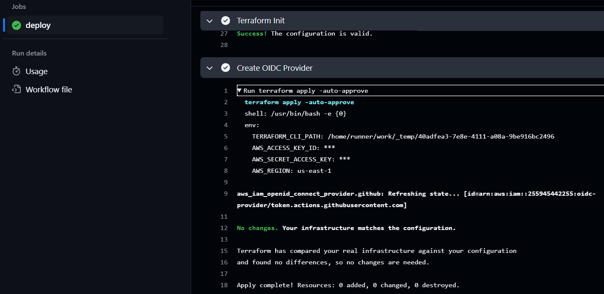

# step 1: run tf-backend repo
https://github.com/keengwatanabe/tf-backend

# step 2: place this s3 backend block in main.tf
terraform {
  backend "s3" {
    bucket = "rgers3.tfstate-backend.com"
    key = "terraform.tfstate"
    region = "us-east-1"
    dynamodb_table = "terraform-state-locks"  # Critical for locking
  }
}
# step 3: (once only), create for aws credentials to GitHub
[code IF A/C able to create temporary IAM role](./docs/bootstrap-tf.md)
[code IF A/C unable to create IAM role](./docs/usingCurrPrivileges.md)
[GitHub manual trigger create OIDC workflow](./docs/manualTrigger.md)

[how](./docs/accesskeys.md) step 1 "Temporary AWS Credentials"
successful run

# step 4 confirm OIDC exists
verify in AWS console, IAM > Identity Providers > token.actions.githubusercontent.com

modify bootstrap-oidc.yml 

# run WITHOUT -target to sync state
`terraform apply -auto-approve`

# CleanUp 
   remove the bootstrap credentials from GitHub Secrets, they are no longer needed.
  (If used your existing user AWS secrets ID and keys, rotate them with replacement ID and keys.)

# step 5: put OIDC arn in github
[secrets keys](./docs/RegularWorkflow.md)

